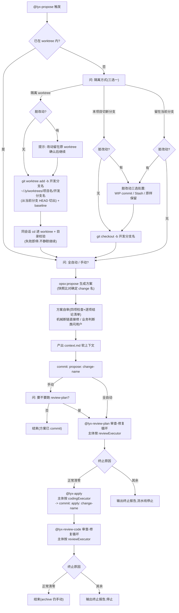
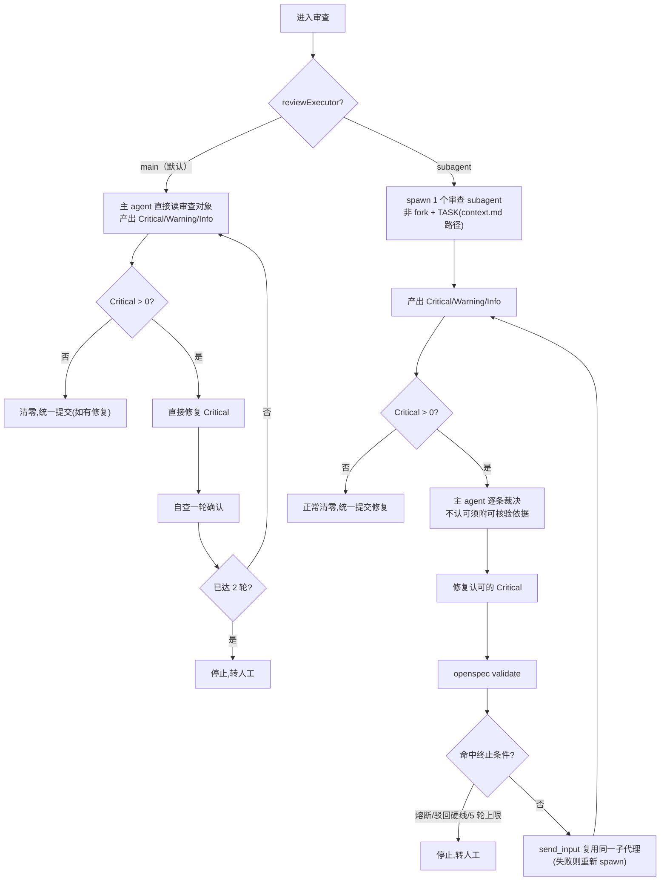
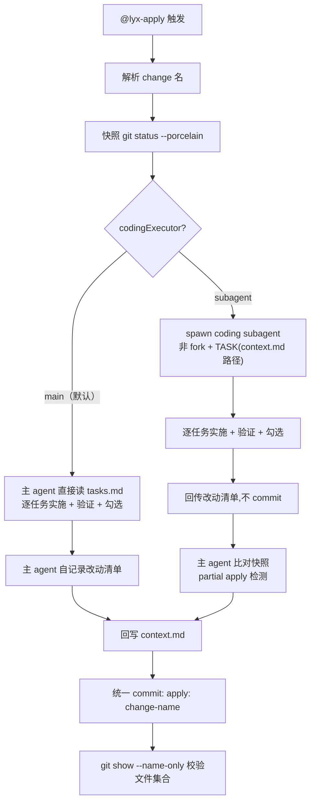
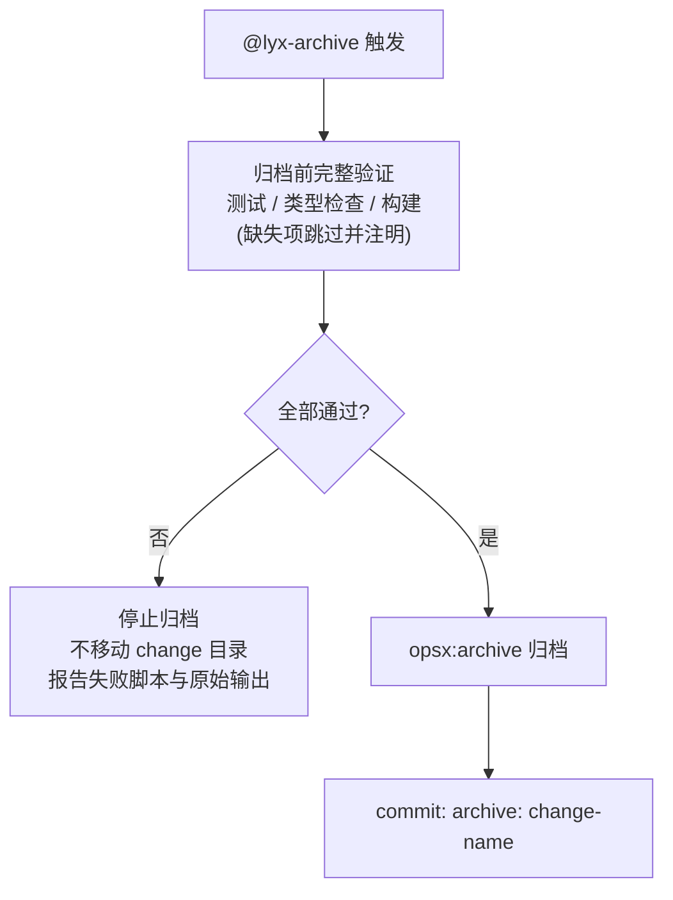

# ly-workflow-codex 工作流程图

> Codex 单 Agent 编排：同一会话内 propose / review / apply；审查与实施主体由 `~/.codex/lyx/config.toml` 的 `[codexHost] reviewExecutor` / `codingExecutor` 决定（未配置等价 `main` = 主 agent 直接执行；`subagent` = spawn 独立子代理）。慢验证（测试 / 类型检查 / 构建）统一由 `@lyx-archive` 的归档前关卡执行一次，审查循环不再重复执行。

## 1. @lyx-propose（编排入口）

## 2. 审查关卡（@lyx-review-plan / @lyx-review-code）

> 两条路径 SHALL NOT 运行测试 / 类型检查 / 构建——慢验证统一由归档前关卡执行。

## 3. @lyx-apply（实施）

## 4. @lyx-archive（归档）

