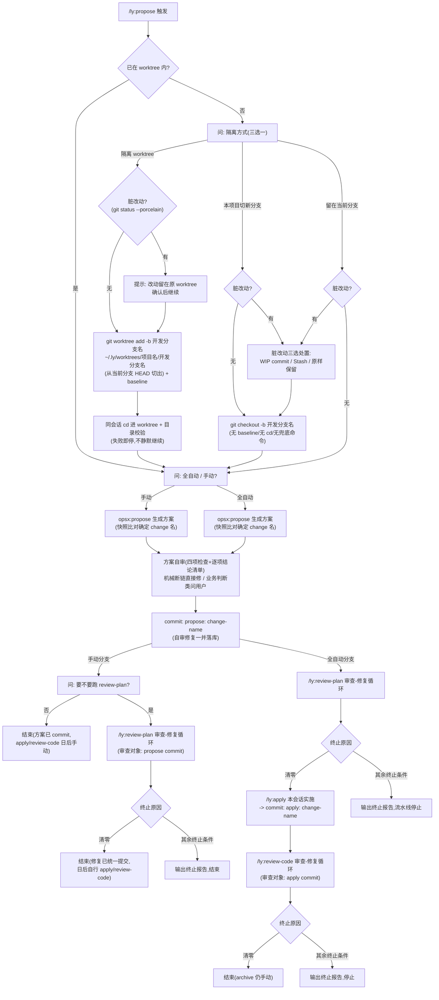
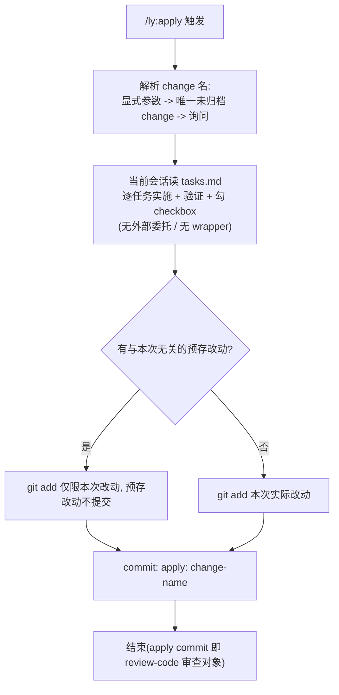
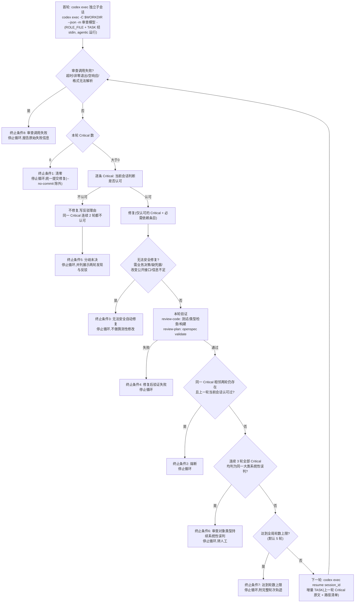

# ly-workflow-codex 工作流程图

> Codex 单 Agent 流程：同一会话内 propose/review/apply 编排；审查关卡走 `codex exec` 独立子会话（调用契约见 [docs/codex-exec-contract.md](./docs/codex-exec-contract.md)）。

## 1. /ly:propose（编排入口）

## 2. /ly:apply（当前会话本人实施）

## 3. 审查-修复循环（review-plan / review-code 共用）

> 循环期间不提交；仅正常清零时统一提交一次。详细契约（session_id 提取、增量传递、终止条件八条、升级 codex 复核清单）见 [docs/codex-exec-contract.md](./docs/codex-exec-contract.md)。
