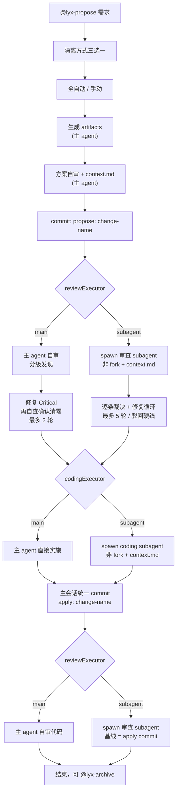
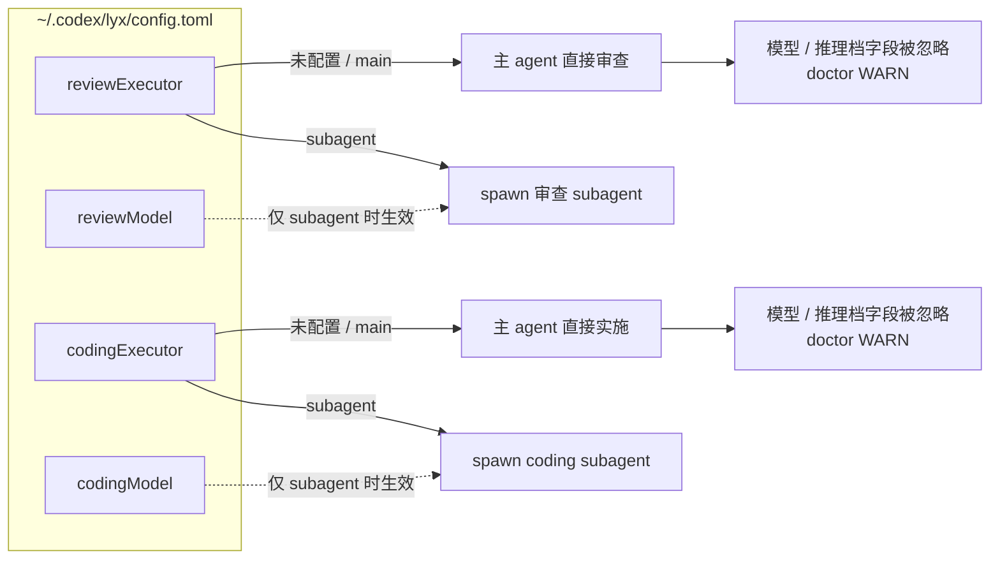
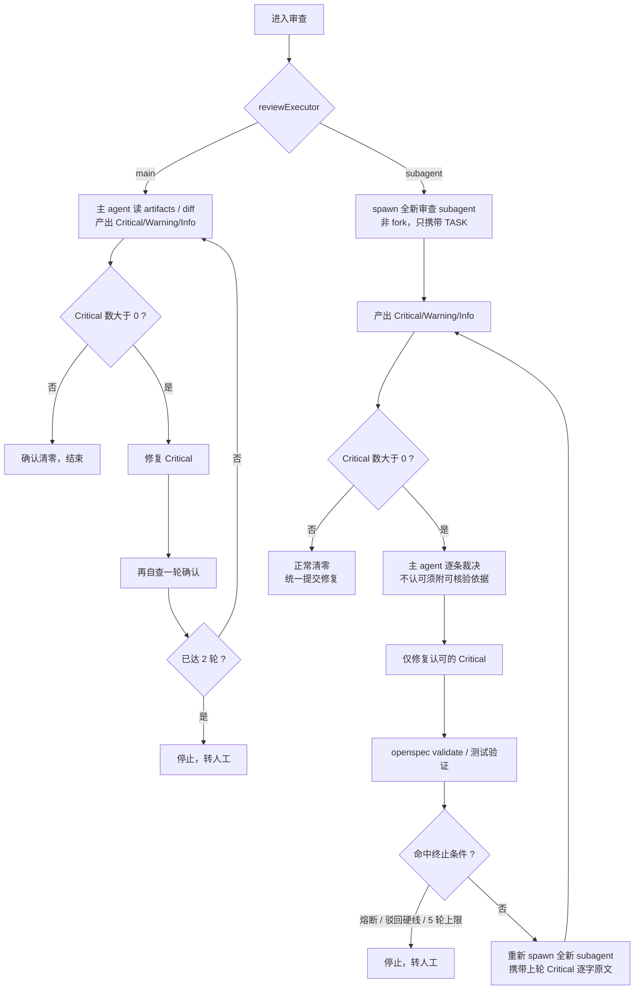
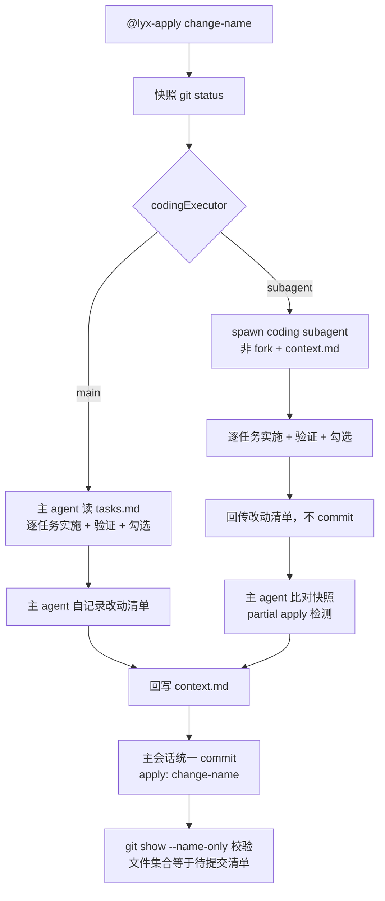
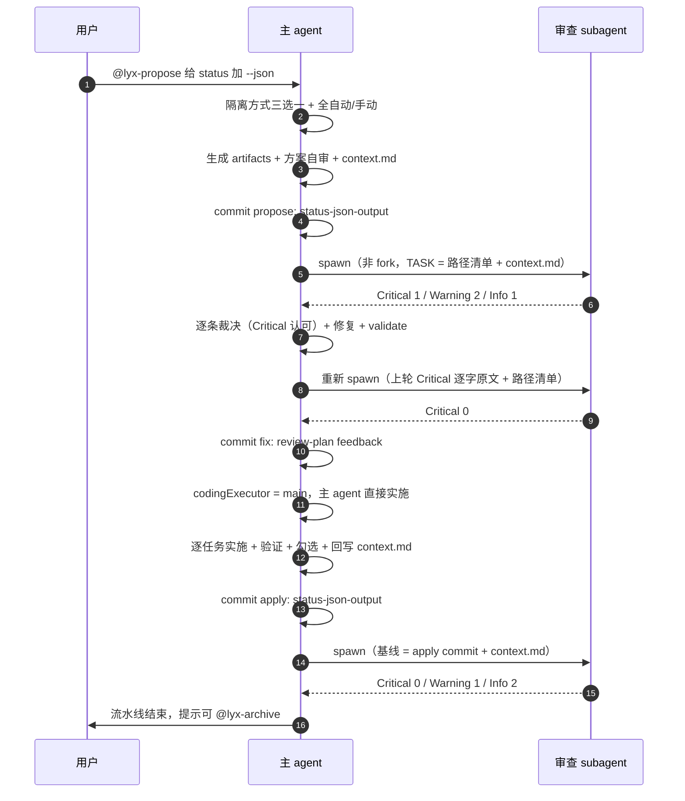

# ly-workflow-codex 工作流程图

> Codex 单 Agent 流程：同一会话内 propose/review/apply 编排。审查与实施各有一个执行者开关——`reviewExecutor` / `codingExecutor` 未配置或为 `main` 时由主 agent 直接执行，为 `subagent` 时 spawn 独立子代理（非 fork，软上下文经 change 目录 `context.md` 到达）。

> **设计态说明**：本文档描述执行者可切换后的目标流程。该能力尚未落地到代码与模板；实现前审查关卡与 apply 仍按 subagent 路径执行。

## 1. 总览：执行者分支

## 2. 配置如何决定走哪条路

## 3. 审查循环：两条路径的差异

## 4. apply 实施：两条路径的差异

## 5. 时序：混合配置下的一次完整流水线

以 `reviewExecutor = subagent`、`codingExecutor = main` 为例。

